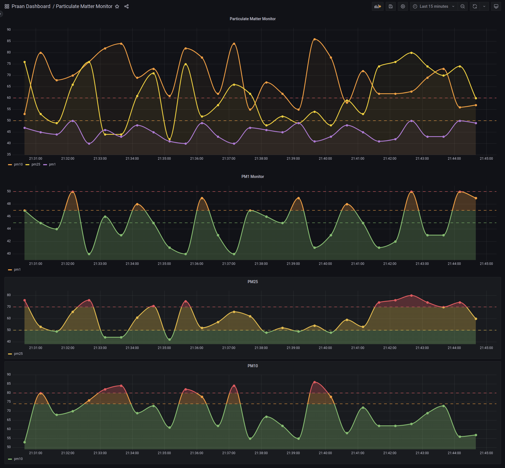

## Grafana dashboard: 

Link: http://54.173.88.47:3000/d/I5kBW6TVk/particulate-matter-monitor?orgId=1&from=now-15m&to=now

In case the login creds are necessary, username: ```admin```, password: ```admin```
 

## Walkthrough:
1. There are 3 main folders: \
    a. ```publisher:```  
    This contains the ```fake_sensor.py``` file which implements a sensor. It sends messages to the ```praan/mqtt``` topic. All the requirements from the task sheet have been 
        implemented. \
    b. ```subscriber_influx:``` \
    This contains the ```push_to_influx.py``` file that subscribes to the ```praan/mqtt``` topic, and when a message is received, pushes it into InfluxDB. \
    c. ```subscriber_mongo:``` \
    This contains the ```push_to_mongo.py``` file that subscribes to the ```praan/mqtt``` topic, and when a message is received, pushes it into MongoDB. \
    d. Each of these folders have a ```Dockerfile``` and a ```docker_commands.md``` file that has the required instructions to create an image and run the container. \
    e. There are currently three ec2 instances that have been provisioned. One that runs grafana (created directly using the official grafana image), one instance that runs the ```push_to_influx.py``` file and one for the ```push_to_mongo.py``` file. The ```fake_sensor.py``` file is being run locally. It sends a message every 30 seconds and is made to randomly go offline. 

## Creating DBs:
1. For InfluxDB, the API token needs to be made use of in the code. The bucket name is provided in the code, if the bucket does not exist, it will be made.
2. For MongoDB, the connection string is used to connect to the DB. 
3. Since it is not advisable to store secrets online, I pass the environment variable to the container, during the ```docker run``` command. 

## Contact:
Feel free to reach me on reubenthomas.john2017@gmail.com if further documentation/clarifications need to be provided. 

FOR LATER:
1. Docker compose file for running everything in containers locally
2. Terraform files for automating infra creation
3. Wrap everything in Github Actions